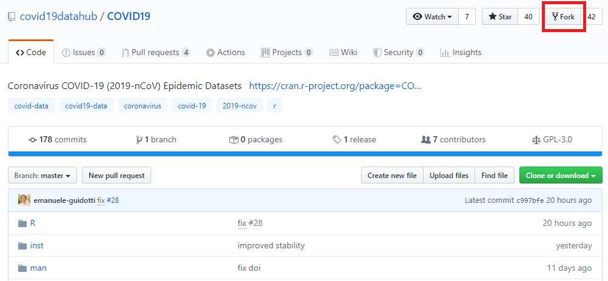

# How-to work with git?

Following procedure explains how to contribute to the project.

## Simple contribution

You found a live source for COVID19 data. Since we do not read from the source yet, you can implement it for us and extend the project.

> Let's say that you would like to add COVID data for *United States*. These data are published by reliable institution, e.g. *US Government* (`gov_us`).

Your contribution is especially essential, if the data is described in a local language (that you speak).

> Basque 
> English (in the case of *United States*) is not the case. But for *Indonesian* fin*Middle-Earth* data probably *elvish*.

Before you start, make sure we really do not read from the source already. Even if we have the data, the data from

To make a contribution, start with **forking the repository** into your own personal Github.



After the forking process you will be automatically forwarded to your fork. Its URL is `https://github.com/<user>/COVID19.git`, where `<user>` is your Github username.

**Clone the fork** to your computer.

```bash
# either via https
git clone https://www.github.com/<username>/COVID19.git
# or via ssh
git clone ssh://git@github.com/<username>/COVID19.git
```


Your source is a dataset from portal of *Library of Minas Tirith* (`libMT`). 

Create a **branch** for your changes.

```bash
# go to the directory
cd COVID19
# create branch
git branch middleearth
# checkout to the branch
git checkout middleearth
```

Data sources are implemented in `R/ds_*.R`, countries in `R/iso_*.R`. Copy template `R/ds_datasource.R` when creating a new datasource or `R/iso_ISO.R` when creating a new country.

```bash
# create a datasource
cp R/ds_datasource.R R/ds_libMT.R # library of Minas Tirith
# create a country
cp R/iso_ISO.R R/iso_MEH.R # MEH - Middle Earth ISO
```

**Implement** the functionality. Keep in mind following:
* Function `MEH()` from `R/iso_MEH.R` returns country data of Middle-Earth on different levels.
  * Level 1 = whole Middle-Earth
  * Level 2 = regions of Middle-Earth (*Shire*, *Gondor*, *Mordor*, ...)
  * Level 3 = cities of Middle-Earth (*Hobbiton*, *Minas Tirith*, ...)
* Function `MEH()` fetches data by calling datasource function `libMT()` from `R/ds_libMT.R`.
* Regional/city data must contain column `id`.
* Unavailable data
  * Return `NULL` if data on a certain level is not available.
  * Specify only variables the data is available for. Missing variables are handled.
  * Missing data on some dates are also handled.

Once you are done, test the functionality, do not forget first to build the package (in RStudio `Build > Intall and Restart`).

To execute, type into R console:

```r
require(COVID19)
# country level data
x1 <- COVID19::covid19("MEH", level = 1, cache = FALSE)
# state (region) level data
x2 <- COVID19::covid19("MEH", level = 2, cache = FALSE)
# city level data
x3 <- COVID19::covid19("MEH", level = 3, cache = FALSE)
```

Compare the data with other resources. Display the data in a table with

```r
View(x1)
```

If the update is ready, publish your changes by typing into terminal

```bash
# create commit
git add .
git commit -m "Middle-Earth implemented."
# push into remote repository
git push --set-upstream origin middleearth
```

Open your repository fork in your browser.


